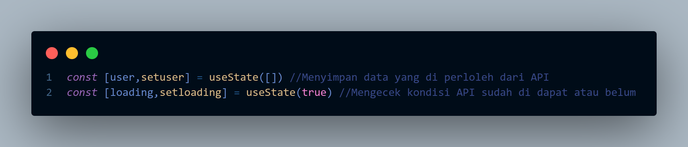
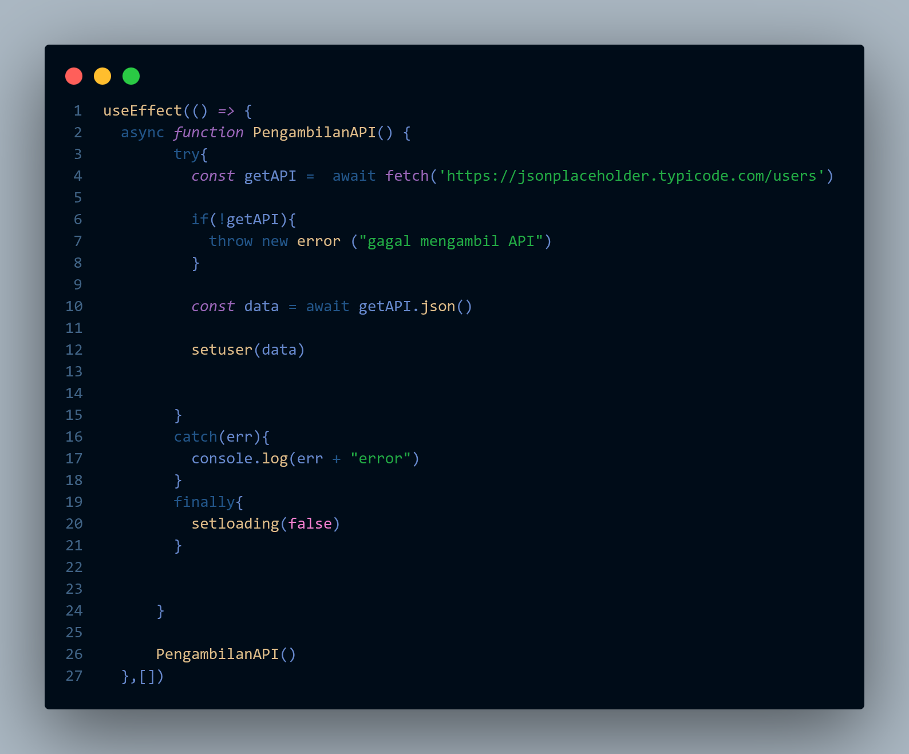
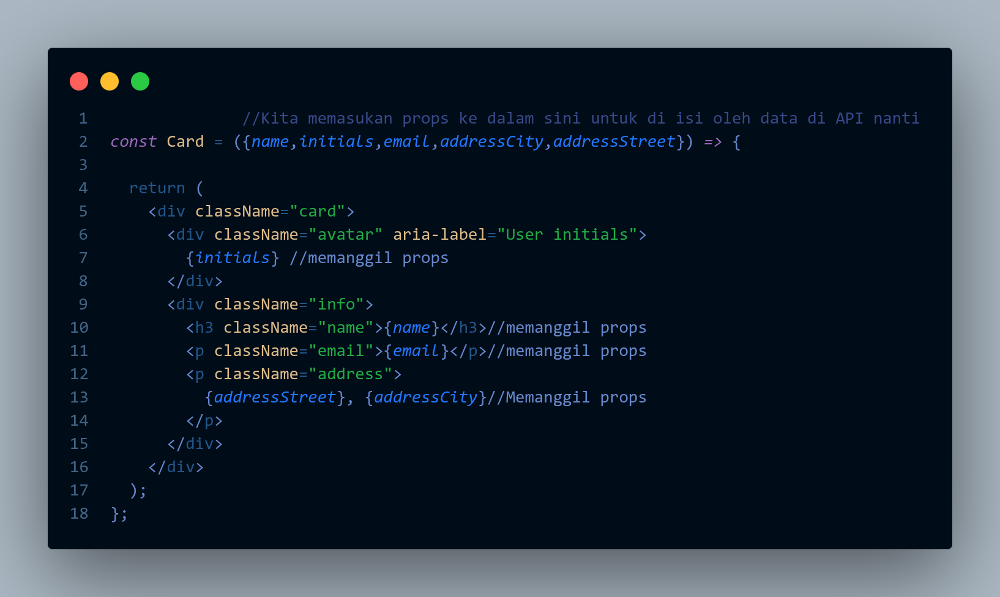
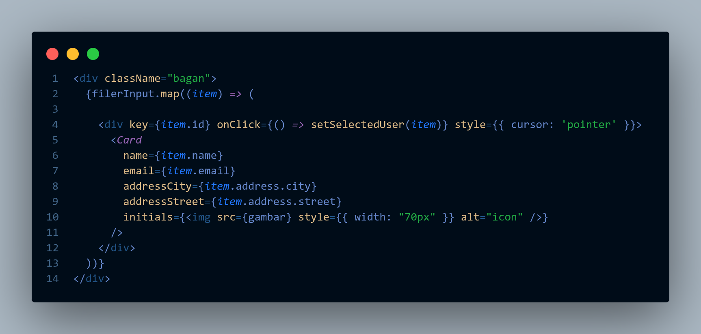
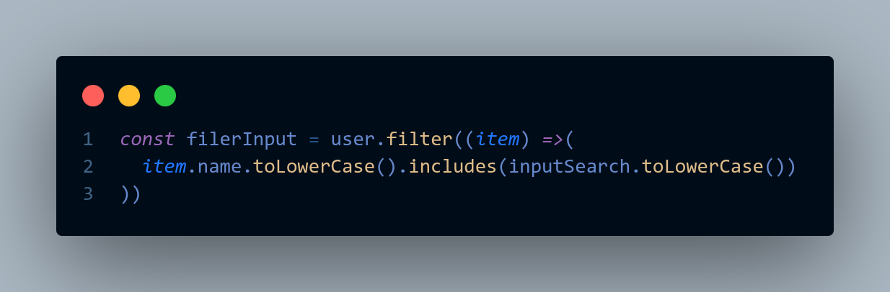
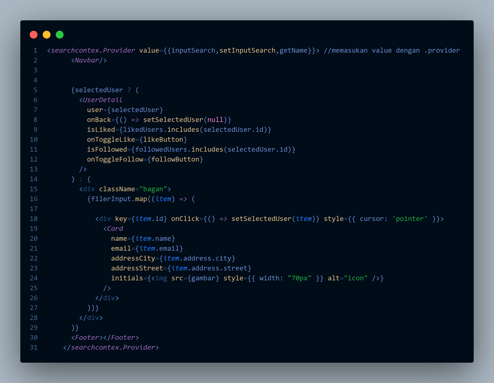
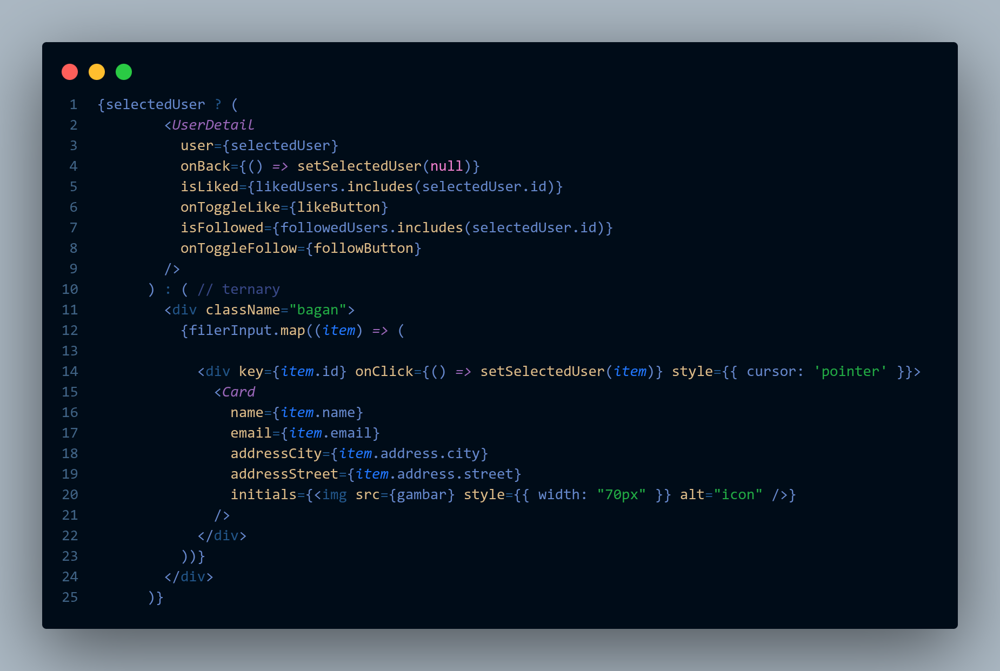
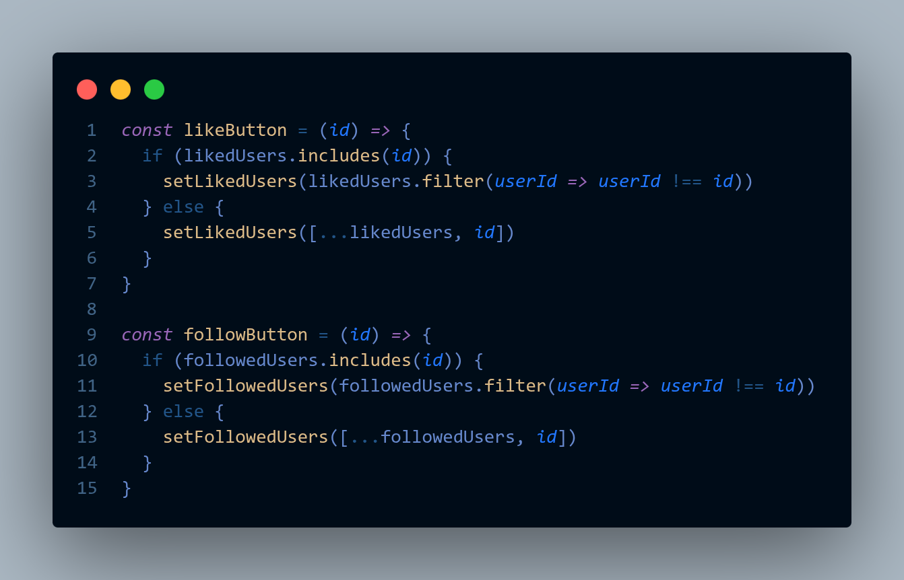
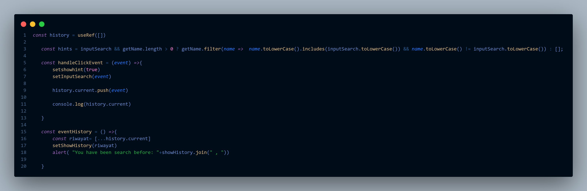
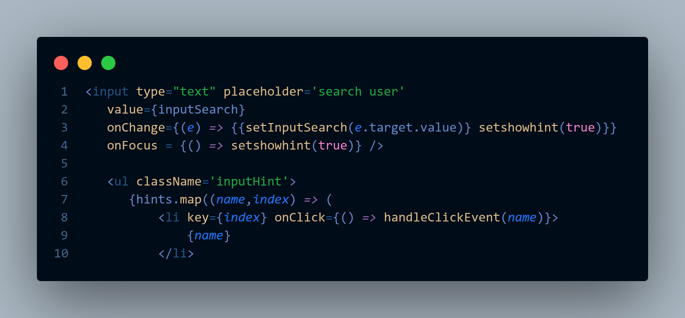

# UPRAK KKJ

Uprak KKJ kali ini mengharuskan kami untuk menggunakan react + hooks untuk membuat sebuah media sosial sederhana dengan menggunakan API dari https://jsonplaceholder.typicode.com/users sebagai data utama

## Instalasi

Clone repository ini dan taruh di folder projek anda

```git
https://github.com/019-Mahansa/UPRAK-KKJ.git
```

Kemudian install node module dengan menggunakan NPM atau PNPM

PNPM

```bash
pnpm install
```

NPM

```bash
npm install
```

Setelah itu run di terminal dengan menggunakan run dev

NPM / PNPM

```bash
npm run dev
atau
pnpm run dev
```

# Alur kode

## hierarki kode
```bash
📦src
 ┣ 📂assets
 ┃ ┣ 📂readme-image
 ┃ ┣ 📜hero.png
 ┃ ┣ 📜icon.jpeg
 ┃ ┣ 📜icon.png
 ┃ ┣ 📜react.svg
 ┃ ┗ 📜vite.svg
 ┣ 📂components
 ┃ ┣ 📂css
 ┃ ┃ ┣ 📜UserDetail.css
 ┃ ┃ ┣ 📜card.css
 ┃ ┃ ┣ 📜footer.css
 ┃ ┃ ┗ 📜navbar.module.css
 ┃ ┣ 📜UserDetail.jsx
 ┃ ┣ 📜card.jsx
 ┃ ┣ 📜footer.jsx
 ┃ ┗ 📜navabar.jsx
 ┣ 📂contexts
 ┃ ┗ 📜inputContext.jsx
 ┣ 📜App.jsx
 ┣ 📜app.css
 ┗ 📜main.jsx
```

**PENJELASAN**

Assets: Berisi semua gambar yang di perlukan dalam website

Components: Berisi semua komponent yang di perlukan dalam page seperti Navbar,footer dan user details

Contexts: Berisi sebagai wadah utama pembuatan context dengan useContext

App.jsx: File utama yang berisi Sistem dan penyusunan komponen

**CARA KERJA**

1. Kita memanggil data dari API menggunakan fetch() dengan menggunakan useEffect agar setiap kali web di refresh maka kode akan jalan terus. Dan menyimpannya di dalam useState




Penjelasan:

Kita menggunakan async function agar sistem yang lain selain pengambilan API dapat berjalan walaupun API belum selesai di panggil, kemudian di dalamnya kita menambahkan try catch yang berfungsi untuk Mencoba dulu memanggil data dan ketika terdeteksi erorr maka akan di lanjutkan oleh catch dan ketika tidak maka catch nya akan di abaikan dan masuk ke finally dengan setloading(false) yang artinya pemanggilan telah selesai

2. Setelah API berhasil terpanggil, sekarang kita membuat tempat(card) untuk kita tampilkan ke UI



3. Kemudian kita isi card tersebut dengan menggunakan function map() untuk mengeluarkan semua isi data dari array. Lalu seperti yang terlihat di bawah gambar terdapat function setSelectedUser(item) yang dimana ini akan kita gunakan nanti untuk mengvalidasi input teks



4. Sistem Pencarian (Search & Filter) dengan Context API
Kita membuat fitur pencarian dengan memanfaatkan filter() pada array user berdasarkan state inputSearch. Agar komponen Navbar dan App bisa saling berbagi data input tanpa perlu prop drilling yang rumit, kita menggunakan Context API (searchcontex).





**Penjelasan:**

Fitur pencarian ini memanfaatkan searchcontex yang diinisialisasi melalui metode createContext() pada file inputContext.jsx. Di dalam file App.jsx, komponen <searchcontex.Provider> digunakan untuk membungkus komponen utama dan mendistribusikan data inputSearch, setInputSearch, beserta array getName ke seluruh tingkatan komponen di bawahnya. Struktur ini memungkinkan komponen Navbar untuk membaca serta memperbarui nilai state pencarian secara langsung tanpa perlu melalui proses prop drilling yang rumit. Proses penyaringan data dilakukan oleh variabel filerInput menggunakan metode .filter() pada array user dengan membandingkan properti name dari setiap objek user dengan string pada inputSearch. Penerapan fungsi .toLowerCase() pada kedua sisi perbandingan memastikan bahwa mekanisme pencarian berjalan secara case-insensitive.

5. Menampilkan Detail User (Conditional Rendering)
Ketika salah satu Card diklik, fungsi setSelectedUser(item) akan terpicu dan menyimpan data user tersebut ke dalam state selectedUser. Untuk merubah tampilan dari daftar urutan Card menjadi halaman detail, kita menggunakan metode Ternary Operator. Jika selectedUser ada isinya, maka tampilkan <UserDetail/>, jika kosong tampilkan daftar <Card/>.



**Penjelasan:**

Mekanisme perpindahan halaman dari daftar kartu user menuju halaman profil detail diimplementasikan menggunakan teknik Conditional Rendering berupa Ternary Operator pada file App.jsx. Saat aplikasi pertama kali dimuat, state selectedUser memiliki nilai default null, yang membuat aplikasi mengeksekusi blok untuk menampilkan daftar komponen <Card/> berdasarkan hasil filter pencarian. Ketika pengguna melakukan klik pada salah satu elemen pembungkus kartu, event handler onClick akan memicu fungsi setSelectedUser(item) untuk mengisi state selectedUser menggunakan objek data user yang dipilih. Perubahan nilai state ini membuat kondisi menjadi true, sehingga aplikasi secara otomatis mengganti tampilan layar menjadi komponen <UserDetail/>. Komponen detail ini kemudian menerima objek data tersebut melalui props beserta fungsi onBack yang mengembalikan nilai state menjadi null ketika tombol kembali diklik.

6. Sistem Like & Follow
Pada halaman UserDetail, terdapat tombol Like dan Follow. State likedUsers dan followedUsers (berupa Array) bertugas menyimpan id dari user yang disukai/diikuti. Logikanya menggunakan pengkondisian includes(): jika id sudah ada di dalam array, maka hapus id tersebut menggunakan filter() (Batal Like/Follow). Jika belum ada, masukkan id tersebut ke dalam array.



**Penjelasan:**

Logika fitur interaksi ini dikelola sepenuhnya di dalam komponen induk App.jsx melalui fungsi likeButton dan followButton dengan memanipulasi dua buah state array, yaitu likedUsers dan followedUsers. Ketika pengguna menekan tombol Like atau Follow pada komponen detail, fungsi terkait akan memeriksa keberadaan elemen id user di dalam array state menggunakan metode .includes(id). Jika metode tersebut menghasilkan nilai true, sistem akan menganggapnya sebagai pembatalan aksi dan menghapus id tersebut menggunakan metode .filter(). Sebaliknya, jika menghasilkan nilai false, sistem akan menambahkan id baru tersebut ke dalam array state dengan menggunakan teknik spread operator agar data yang sudah ada tidak tertimpa. Status evaluasi boolean dari pencarian ini kemudian dikirim ke komponen <UserDetail/> sebagai props isLiked dan isFollowed untuk mengubah gaya CSS tombol secara dinamis.

7. Fitur Hint Pencarian dan History (Navbar)
Pada komponen Navbar, terdapat sistem autocomplete (hint) sederhana yang mencocokkan input ketikan dengan array nama dari API. Selain itu, terdapat fitur riwayat (History) pencarian. Kita menggunakan useRef() untuk menyimpan riwayat ini agar datanya tidak hilang atau ter-reset (tidak memicu re-render) saat user mengetik sesuatu.




**Penjelasan:**

Fitur rekomendasi otomatis pada komponen Navbar dikendalikan oleh variabel hints yang melakukan penyaringan terhadap array getName untuk menampilkan kecocokan nama secara real-time hanya jika teks input pencarian telah terisi dan menyembunyikannya jika teks sudah sama persis. Untuk melacak riwayat pencarian, komponen menggunakan React Hook useRef([]) yang diinisialisasi sebagai array kosong agar perubahan datanya tidak memicu proses re-render ulang pada komponen Navbar. Hal ini menjaga performa dan mencegah hilangnya fokus pada elemen input saat pengguna sedang mengetik. Setiap kali pengguna mengklik salah satu nama pada kotak rekomendasi, fungsi handleClickEvent akan dipanggil untuk memasukkan string nama tersebut ke dalam array riwayat menggunakan metode .push(event). Ketika tombol riwayat ditekan, fungsi eventHistory akan menyalin seluruh elemen yang tersimpan di dalam referensi tersebut ke dalam state showHistory dan menampilkannya ke layar menggunakan dialog alert().
