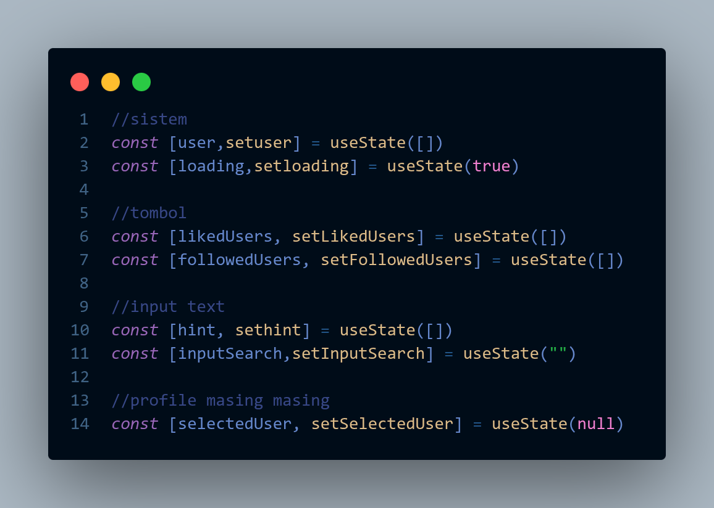
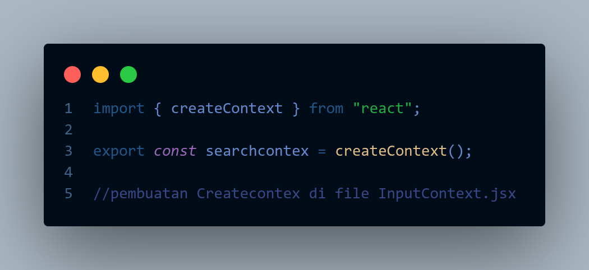
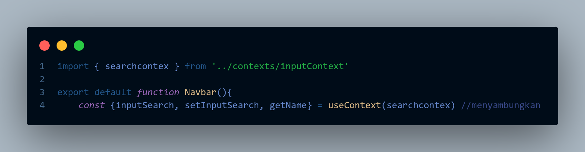
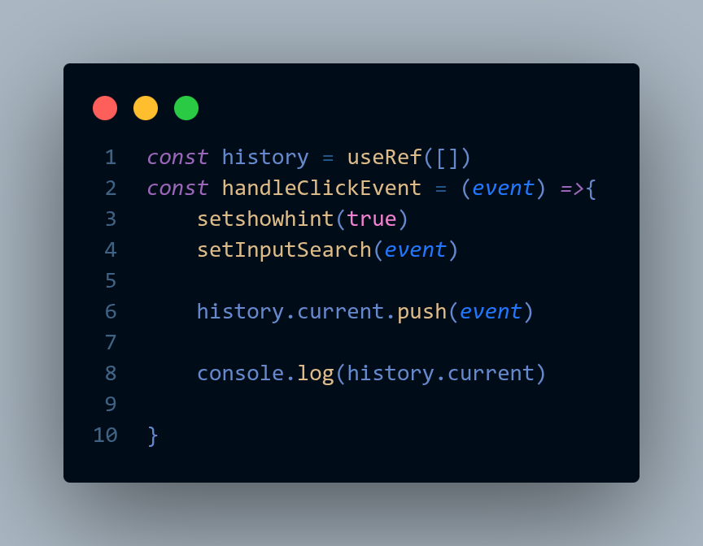

# Dokumentasi UPRAK KKJ 

Proyek ini adalah web media sosial sederhana yang dibangun menggunakan React + Vite, dengan memanfaatkan API dari JSONPlaceholder sebagai sumber data utama.

## 1. Penjelasan Component
tampilan web ini di pecah menjadi beberapa bagian dari beberapa file berbeda. Yang bertujuan untuk membuat file lebih rapih:
* **App.jsx**: Komponen utama yang menjadi kontainer sistem. Mengatur state global, logika pemanggilan API, *conditional rendering* untuk pindah ke halaman detail, serta logika fitur *Like* dan *Follow*.
* **navabar.jsx**: Komponen navigasi atas. Berisi kolom pencarian (search bar) yang dilengkapi fitur *autocomplete hint* dan tombol untuk melihat riwayat pencarian.
* **card.jsx**: Komponen antarmuka (UI) *reusable* yang berfungsi menampilkan ringkasan informasi pengguna (nama, email, alamat) dalam bentuk kartu.
* **UserDetail.jsx**: Komponen yang merender halaman profil spesifik secara mendalam ketika pengguna mengklik salah satu *Card*.
* **footer.jsx**: Komponen statis di bagian bawah halaman untuk informasi pembuat web.

## 2. Penjelasan Fetch API
sistem mengambil data pengguna dari `https://jsonplaceholder.typicode.com/users` menggunakan fungsi bawaan `fetch()`. Proses pemanggilan API ini dibungkus di dalam *hook* `useEffect` dengan *dependency array* kosong `[]` pada `App.jsx`. Tujuannya agar pengambilan data dan perubahan state (dari loading menjadi selesai) hanya tereksekusi satu kali tepat ketika komponen pertama kali dimuat.

## 3. Implementasi React Hooks

Berikut adalah implementasi *Hooks* yang digunakan dalam proyek beserta bukti kodenya:

### A. useState
Digunakan untuk membuat dan mengelola data dinamis yang dapat memicu pembaruan UI (re-render). Pada proyek ini, `useState` dipakai untuk menyimpan data *user* dari API, status *loading*, input pencarian, hingga daftar *id* pengguna yang disukai (*likedUsers*).

### B. useEffect
Digunakan untuk menangani *side-effects*, yaitu mengeksekusi operasi async chronus (Fetch API) secara aman saat aplikasi baru saja dibuka tanpa memblok proses *rendering* awal aplikasi.

### C. useContext
Digunakan untuk membagikan state pencarian (`inputSearch` dan `setInputSearch`) dari komponen induk `App.jsx` langsung ke dalam komponen `navabar.jsx`. Pendekatan ini menyelesaikan masalah *prop-drilling* sehingga data tidak perlu dioper satu per satu melewati komponen yang tidak membutuhkannya.

### D. useRef
Digunakan di dalam `navabar.jsx` untuk menyimpan array data riwayat pencarian (`history.current`). Penggunaan `useRef` di sini sangat penting karena perubahan data di dalamnya tidak akan memicu komponen *Navbar* untuk melakukan *re-render*. Hal ini memastikan kursor pengguna tidak kehilangan fokus (*lose focus*) saat mereka sedang asyik mengetik di dalam kolom input.

